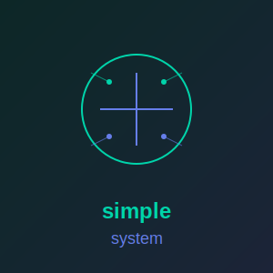

<p align="center">
  
</p>

# SIMPLE_SYSTEM

**[Documentation](https://simple-eiffel.github.io/simple_system/)**

### System Information Library for Eiffel

[](https://www.eiffel.org/)
[](LICENSE)
[]()
[]()
[]()

---

## Overview

SIMPLE_SYSTEM provides SCOOP-compatible system information access for Eiffel applications. It wraps Win32 system APIs through a clean C interface, enabling queries about the computer, processor, memory, and operating system without threading complications.

**Developed using AI-assisted methodology:** Built interactively with Claude Opus 4.5 following rigorous Design by Contract principles.

---

## Features

### Information Categories

- **Computer** - Computer name, user name
- **Directories** - Windows, System32, Temp directories
- **Processor** - Count, architecture (x86/x64/ARM64), page size
- **Memory** - Total and available memory in MB/GB
- **OS Version** - Major/minor version, build number, Windows 10/11 detection

---

## Quick Start

### Installation

1. Clone the repository:
```bash
git clone https://github.com/simple-eiffel/simple_system.git
```

2. Compile the C library:
```bash
cd simple_system/Clib
compile.bat
```

3. Set the ecosystem environment variable (one-time setup for all simple_* libraries):
```bash
set SIMPLE_EIFFEL=D:\prod
```

4. Add to your ECF file:
```xml
<library name="simple_system" location="$SIMPLE_EIFFEL/simple_system/simple_system.ecf"/>
```

### Basic Usage

```eiffel
class
    MY_APPLICATION

feature

    system_info_example
        local
            sys: SIMPLE_SYSTEM
        do
            create sys

            -- Computer info
            print ("Computer: " + sys.computer_name + "%N")
            print ("User: " + sys.user_name + "%N")

            -- Directories
            print ("Windows: " + sys.windows_directory + "%N")
            print ("Temp: " + sys.temp_directory + "%N")

            -- Processor info
            print ("CPUs: " + sys.processor_count.out + "%N")
            print ("Architecture: " + sys.processor_architecture + "%N")
            print ("64-bit: " + sys.is_64_bit.out + "%N")

            -- Memory info
            print ("Total RAM: " + sys.total_memory_gb.out + " GB%N")
            print ("Available: " + sys.available_memory_gb.out + " GB%N")

            -- OS info
            print ("OS Version: " + sys.os_version_string + "%N")
            print ("Windows 11: " + sys.is_windows_11.out + "%N")
        end

end
```

---

## API Reference

### SIMPLE_SYSTEM Class

#### Computer Information

```eiffel
computer_name: STRING_32
    -- Name of the computer.

user_name: STRING_32
    -- Name of the current user.
```

#### Directory Information

```eiffel
windows_directory: STRING_32
    -- Windows installation directory (e.g., "C:\Windows").

system_directory: STRING_32
    -- System directory (e.g., "C:\Windows\System32").

temp_directory: STRING_32
    -- Temporary files directory.
```

#### Processor Information

```eiffel
processor_count: INTEGER
    -- Number of logical processors.

processor_architecture: STRING_32
    -- Processor architecture name ("x86", "x64", "ARM64", "unknown").

is_64_bit: BOOLEAN
    -- Is the processor 64-bit?

page_size: INTEGER
    -- Memory page size in bytes.
```

#### Memory Information

```eiffel
total_memory_mb: NATURAL_64
    -- Total physical memory in megabytes.

available_memory_mb: NATURAL_64
    -- Available physical memory in megabytes.

total_memory_gb: REAL_64
    -- Total physical memory in gigabytes.

available_memory_gb: REAL_64
    -- Available physical memory in gigabytes.
```

#### OS Information

```eiffel
os_major_version: INTEGER
    -- OS major version number.

os_minor_version: INTEGER
    -- OS minor version number.

os_build_number: INTEGER
    -- OS build number.

os_version_string: STRING_32
    -- Full OS version as string (e.g., "10.0.22631").

is_windows_10_or_later: BOOLEAN
    -- Is this Windows 10 or later?

is_windows_11: BOOLEAN
    -- Is this Windows 11? (Build 22000+)
```

---

## Building & Testing

### Build Library

```bash
cd simple_system
ec -config simple_system.ecf -target simple_system -c_compile
```

### Run Tests

```bash
ec -config simple_system.ecf -target simple_system_tests -c_compile
./EIFGENs/simple_system_tests/W_code/simple_system.exe
```

---

## Project Structure

```
simple_system/
├── Clib/                       # C wrapper library
│   ├── simple_system.h         # C header file
│   ├── simple_system.c         # C implementation
│   └── compile.bat             # Build script
├── src/                        # Eiffel source
│   └── simple_system.e         # Main wrapper class
├── testing/                    # Test suite
│   ├── application.e           # Test runner
│   └── test_simple_system.e    # Test cases
├── simple_system.ecf           # Library configuration
├── README.md                   # This file
└── LICENSE                     # MIT License
```

---

## Dependencies

- **Windows OS** - System APIs are Windows-specific
- **EiffelStudio 23.09+** - Development environment
- **Visual Studio C++ Build Tools** - For compiling C wrapper

---

## SCOOP Compatibility

SIMPLE_SYSTEM is fully SCOOP-compatible. The C wrapper handles all Win32 API calls synchronously without threading dependencies, making it safe for use in concurrent Eiffel applications.

---

## License

MIT License - see [LICENSE](LICENSE) file for details.

---

## Contact

- **Author:** Larry Rix
- **Repository:** https://github.com/simple-eiffel/simple_system
- **Issues:** https://github.com/simple-eiffel/simple_system/issues

---

## Acknowledgments

- Built with Claude Opus 4.5 (Anthropic)
- Uses Win32 System APIs (Microsoft)
- Part of the simple_ library collection for Eiffel
